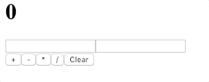

# React Calculator

> How does it work?
---
The buttons and input fields were made simply with HTML syntax. React event listeners were bound to the HTML elements. Anytime a number was typed, the state of the `Calculator` React component was updated. Clicking any one of the operations simply updates the `Result` slice of state. 